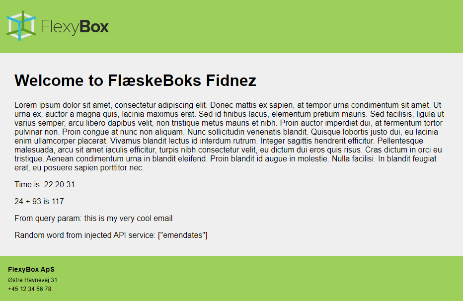

# EmailGenerator
## Experiment project for creating dynamic HTML emails using Razor Components

### Example

Request `GET https://localhost:7219/Email?param=this%20is%20my%20very%20cool%20email` returns HTML:



The component hirearchy for this email (`WelcomeEmail.razor`) is
```
DefaultLayout.razor
├─ FlexyBoxHeader.razor
├─ ContactInformation.razor
│
└─ WelcomeEmail.razor
```

### Things to consider

* How to localize default component text?
* How to manage global styles?
